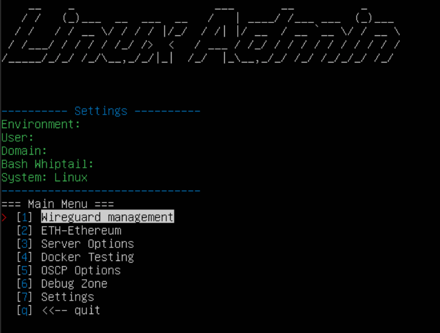
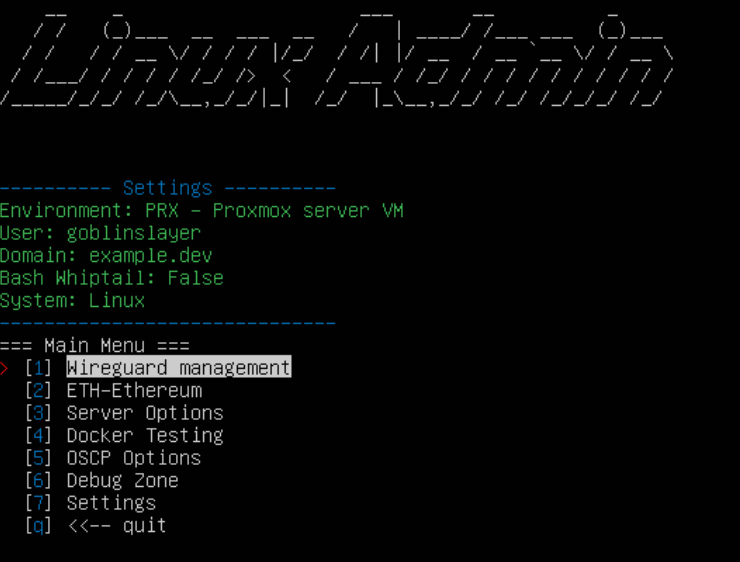
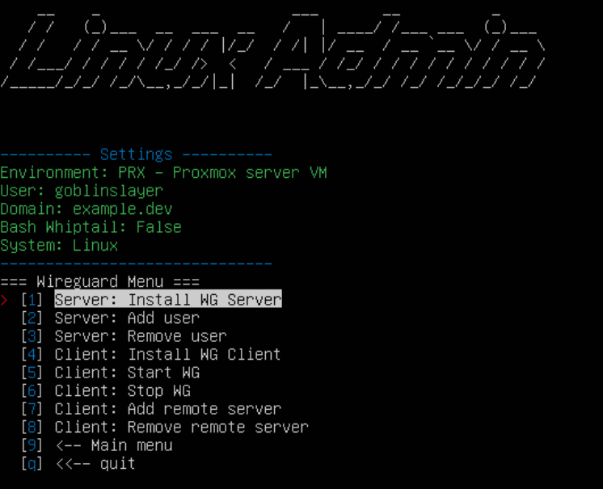

# PythonWeAllJustBashAlong

A Python script using a terminal menu that passes arguments to a Bash script.


Includes:

- [Wireguard](#Wireguard) - VPN server and client management.

  - https://www.youtube.com/watch?v=K609GiqeBEU&t=13s (OLD Demo video).

- [Ethereum](#Ethereum) - Setup a wallet. Start mining.
- [System](#System) - Install some packages. Sample configuration.
- [Docker](#Docker) - Install and manage the sample compose file.
- [OSCP](#OSCP) - A few tools but, as strangely named menu items.

<br><br>

# Getting Started

As you would with all scripts you find on the internet, please read it to make sure you understand what the code does and how it would affect your system.

Tested on Ubuntu 18.04 & 20.04
<br>

## Requirements/Dependencies

- sudo privileges
- Python 3
- Pip3

<br>

## Python 3 & Pip3

```
sudo apt install -y python3
sudo apt install -y python3-pip
```

<br>

## Install the required packages

```
pip3 install -r requirements.txt
```

<br>

## Usage

```
python3 _pythonWeAllJustBashAlong
```

<br><br>
Navigate the menus using the arrow keys or the corresponding shortcut.
<br>
<br>

<br><br>
Configure the settings. These are a few of the variables passed into each of the bash scripts. This standard way of ensuring the right Environment, User and Domain has been useful for administering various systems.

The validator script is an example of how you can check some preset values and return a value to another bash script, without writing to a file. This example checks if a value has been selected for each of the settings.

<br>
<br>

<br><br>

# Wireguard

<br>
Port forwarding is required to direct traffic to the server but it is not covered by this script. The demo video along with the quick steps below can help you get up and running quickly using a VPS provider like AWS or Linode.
<br>
<br>

Quick, step by step once port forwarding has been setup

- 1 - SERVER -> Run the server install
- 2 - SERVER -> Show the server public key (sudo wg)
- 3 - CLIENT -> Run the client install
- 4 - CLIENT -> Start WG then, Show the Client public key (sudo wg)
- 5 - SERVER -> Add the client public key to the server (Add user)
- 6 - CLIENT -> Add the server public key to the client (Add remote server)

<br>
<br>
<br><br><br><br>

# Ethereum

<br>
Modify the script values for the Mining Pool and the Wallet Address before you start mining.
<br>

### Requirements/Dependencies

- Nvidia GPU
- Ethereum Wallet
- Mining Pool account (Only tested using Sparkpool)

<br>

Quick, step by step after you have modified the script with your wallet and mining pool

- 1 - Install the required packages
- 2 - Start mining

Selecting "Open ETH-Wallet" will open the Desktop app. You can generate a wallet address using that app.

<br><br>

# System

<br>
A sample of how you can configure a system based on the environment that you are in.

Example: If the Environment is a VirtualBox VM, the script will run the function to install the Guest Additions. If it is a Proxmox VM, install the qemu-guest-agent.

<br>
<br>

# Docker

<br>
Install Docker and manage the sample docker-compose file.

Config includes:

- MySQL
- WordPress
- PrivateBin - [https://privatebin.info/](https://privatebin.info/)
- Jellyfin - [https://jellyfin.org/](https://jellyfin.org/)

<br>
<br>

# OSCP

<br>
A sample of how you can make studying for your OSCP more fun (or just more complex) by setting weird menu item names.

Examples:

- Oden Nitoryu: Tougen Shirataki (Autorecon scan on the target)
- Nitoryu: Nigiri Toro Samon (Reconbot nmap only scan on the target)

Tested on Kali 2020.4

<br><br>

# Credits | Links | Misc.

Wireguard

- https://www.wireguard.com/quickstart/
- https://www.linuxbabe.com/ubuntu/wireguard-vpn-server-ubuntu
- (OLD Demo video) https://www.youtube.com/watch?v=K609GiqeBEU&t=13s

Python

- (PyInquirer) https://github.com/CITGuru/PyInquirer
- (simple_term_menu) https://www.youtube.com/watch?v=Zpa-rc9e388&t=321s

Ethereum

- https://github.com/ethereum-mining/ethminer
- https://github.com/ethereum/mist/releases

<br><br><br><br>

# License

This project is licensed under the GNU General Public License v3.0 - see the [LICENSE.md](LICENSE) file for details.
<br><br><br><br>
